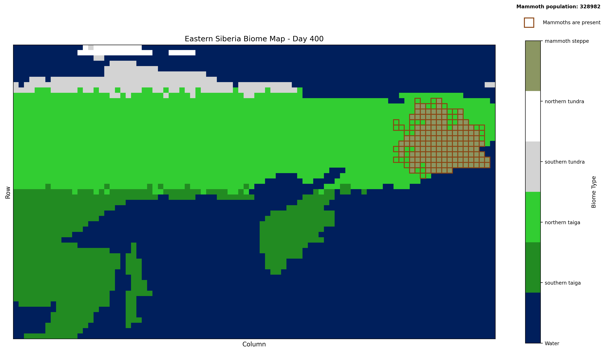

# Mammoth Repopulation Simulator:
With the advent of genetic cloning repopulating mammoths in Siberia has been a new hot topic, not only for the novelty but also for its potential environmental benefits. This project aims at simulating mammoth repopulation in present day Siberian biomes, and transform the landscape into what was once Ice Age (mammoth) steppe. The idea is that only very large herbivoires such as mammoths will trample trees/shrubs thereby making way for greater grass growth. They will also compact snow which contributes to permafrost soil conditions, thus cooling the air.

I recognize there is a great limitation on the accuracy of this project due to the scale of such a simulation. Nonetheless, it opens a doorway to this world in a fun and engaging way. 

# Simulation Window


# The simulation will:
- Initialize a grid based on real Siberian geography
- Add mammoths to specified location
- Run the simulation for a specified number of days
- Update climate conditions probabilistically (based on real extracted data)
- Plot-level Flora and Fauna total mass updates based on environmental penalties and    growth rates
- Achieve an Ice Age mammoth-steppe biome via megafauna trampling and grazing 
- Display real-time visualization of biome changes

# Future plans:
- UI cursor-based custom placement of Prey/Predator on map
- Dockerization (possibly run simulation window in browser)
- Edit/Change simulation variables in UI
- Save/store initial simulation conditions
- Introduce Predators and other Prey
- Integrate premafrost requirement into mammoth steppe condition
- Version with mammoth herd as a reinforcement learning model

## Installation

1. **Clone the repository**:
   ```bash
   git clone <repository-url>
   cd mammoth_repopulation
   ```

2. **Install dependencies**:
   ```bash
   pip install -r requirements.txt
   ```

   Note: `pygrib` is only needed for processing GRIB files into CSV (not required to run the simulation).

## Running the Simulation

To run the mammoth repopulation simulation:

```bash
python -m app.main
```

Or from the `app` directory:

```bash
cd app
python main.py
```

You can modify simulation parameters in `app/main.py`:
- `num_days`: Number of days to simulate (default: 370)
- `population_per_km2`: Initial mammoth population density
- `visualize`: Whether to show real-time visualization

## Requirements

- **Python 3.8+**

**Python Packages** (install via `pip install -r requirements.txt`):
- `pandas` - Data manipulation and analysis
- `numpy` - Numerical computing
- `geopandas` - Geographic data processing
- `shapely` - Geometric operations
- `matplotlib` - Visualization and plotting
- `pytest` - Testing framework
- `pytest-cov` - Test coverage reporting

**Optional**:
- `pygrib` - Only needed for processing GRIB files into CSV (already completed)

## Testing

This project includes comprehensive test coverage with unit and integration tests. All tests include automatic coverage reporting.

- **Test Suite**: Unit tests for individual components and integration tests for end-to-end functionality
- **Coverage Reporting**: Automatic code coverage tracking (see `TESTING.md` for details)
- **Test Runner**: Run tests with `python run_tests.py`

For detailed testing information, see [TESTING.md](TESTING.md).

## Locations Covered for Climate Data
- Krasnoyarsk (southern taiga)
- Salekhard (northern taiga)
- Saskylakh (southern tundra)
- Cape Chelyuskin (northern tundra)

## Climate Data Attribution
This project uses data from the **Copernicus Climate Data Store (CDS)**:
- Product: ERA5 hourly data on single levels
- Variable: 2 metre temperature (short name `2t`)
- License: [Copernicus Licence](https://cds.climate.copernicus.eu/disclaimer/licence)
- Data provider: European Centre for Medium-Range Weather Forecasts (ECMWF)

Derived temperature statistics (not raw data) are shared in this repository.

### Map Data Attribution
The file `custom.geo.json` was generated from [https://geojson-maps.kyd.au](https://geojson-maps.kyd.au),
a public tool for generating simplified GeoJSON maps.

Underlying data is likely derived from either:
- [Natural Earth](https://www.naturalearthdata.com/) — public domain, or
- [OpenStreetMap](https://www.openstreetmap.org/) — Open Database License (ODbL)

If the source is OpenStreetMap, the following attribution applies:
OpenStreetMap contributors | www.openstreetmap.org | ODbL 1.0